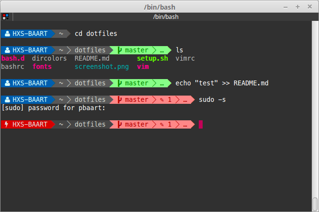

# dotfiles
My custom terminal settings
* Molokai colorsheme
* Better dircolors

## Autocomplete SSH hosts
* autocomplete hosts based on incinga hosts.
* 
* update scripts for cronjobs
* additional custom hosts in custom.hosts file

## VIM config powerline
* NERDTree Tabs
* Emmet
* linelight

## Additional fonts
* Menlo Powerline
* FontAwesome

## Pretty prompt
* Customized version
* based on: https://github.com/ashikahmad/PrettyPrompt

## Bash customization
* additional aliases
* bash completions
